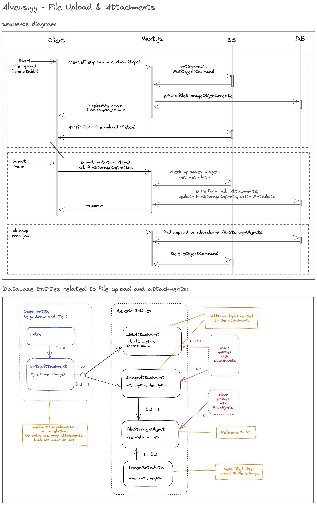

# File upload and attachments

## File upload

File uploads are implemented using pre-signed S3 URLs. This means that the client uploads the file directly to S3.
For that the client sends a mutation to the server. The server creates a `FileStorageObject` reference in the database
and creates a pre-signed upload URL using the S3 sdk. The upload url and a file reference id get returned to the client.
With that URL the client can upload the file directly to S3 using a HTTP PUT request.
On the client we keep the file storage object id and when the user then submits the form, the client sends the file
storage object id to the server along with the other form data.
On the server side the file reference id is used to check if the file was uploaded successfully.
If the file was uploaded successfully, the file storage object gets connected to the entity that was created or updated.
If the files is an image, the image metadata (mimetype, width, height) gets extracted server-side by probing the uploaded file on S3 and stored
in the database.

## Attachments (for example Show and Tell entries)

- an `ShowAndTellEntry` can have many attachments that are either images or links
- to implement this polymorphic m:m relation an `ShowAndTellEntryAttachment` relation table is used
- `LinkAttachment` and `ImageAttachment` are separate tables that have additional fields like a title, description, etc.
- `ImageAttachment` are connected with the uploaded `FileStorageObject`
- image metadata extracted server-side after submit, is written to the `ImageMetadata` table and connected to the `FileStorageObject`
